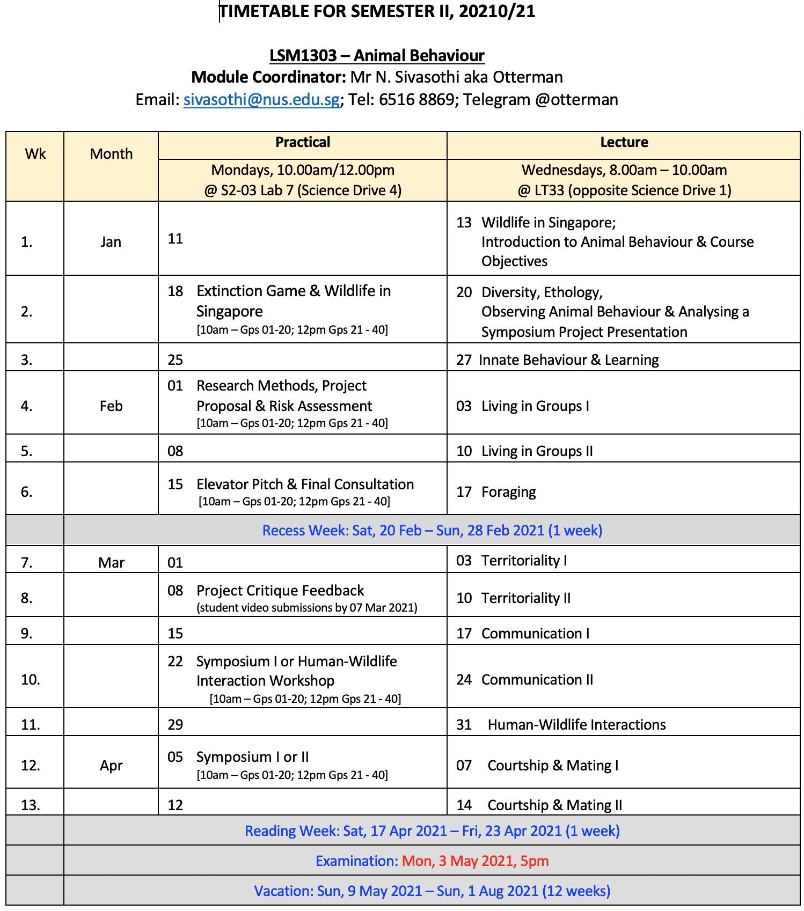

# LSM1303 Animal Behaviour

## Syllabus

## Using these notes

<aside>
👉 use the glossaries to search for specific animals or concepts, if you don't know which lecture they belong to!

</aside>

<aside>
⚠️ these notes are not perfectly updated; feel free to leave a comment if there are mistakes or things I should add. they are taken from the lectures from my lecture and prof Siva may update or change the material he uses in later years

</aside>

## notes

[Glossary of Concepts](notes/Glossary%20of%Concepts.md)

[Glossary: Animals](notes/Glossary%20of%20Animals.md)

---

[Introductory Lecture](notes/Introductory-Lecture.md)

[Territoriality](notes/Teritoriality.md)

[Foraging](notes/Foraging%20ec1ac.md)

[Group Behaviour](notes/Group-Behaviour.md)

[Ecology concepts](notes/Ecology-Concepts.md)

[Courtship and mating](notes/Courtship-and-Mating.md)

[Animal Welfare](notes/Animal%20Welfare.md)

## cool links

nus toddycats - enviornmental events & advocacy!

[About](https://toddycats.wordpress.com/about/)

[Join group chat on Telegram](https://t.me/joinchat/ILoG9YP1NjU3OWZl)

if prof siva made you curious about otters, maybe you would want to follow otterwatch:

[Log In or Sign Up to View](https://www.facebook.com/OtterWatch/)

raffles ecolit books — children's books based on singapore's nature scene! i wrote *The Legend Of The Spider Knight* but all the books are available in libarires and online; do share with your friends!

[Raffles Ecolit Publications](https://ivy.ri.edu.sg/courses/2007)

if you are interested in leopard cats, perhaps you would be interested in this 12 minute documentary put together by NUS students: *"The Last Wildcat in Singapore"* which i voiced!

[https://www.youtube.com/watch?v=hK6sLqdGGA8](https://www.youtube.com/watch?v=hK6sLqdGGA8)

[Singapore Wildcat Action Group](https://www.swagcat.org/?fbclid=IwAR28deYgMLVkHgZxLRWOI_-9g1x3TkRiB0EFXAoklY6POiRJIRR6W8lHljg)