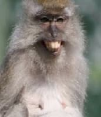

# Glossary of Concepts

i. selective breeding

ii. territorial behaviour

iii. instinct

iv. courtship behaviour

v. fixed action pattern

A stimulus is any change in an animal's environment(temperature, pressure, radiation, gravity, or the activities of other nearby organisms)

A response is any behaviour or physiological event - internal, external

Trait: A morphological characteristic or a behavioural characteristic of an organism.

- Allows an organism to survive and reproduce in its specific environment (niche)

---

## innate responses

- Simple behaviours that do not require thought, they are things they just do instinctively, without observing an example. not learnt or modified by learning
- Selected for increased survival value to the species.
- an inheritance of nerve pathways.

Categories include

1. orientation → which direction they go
    - phototaxy: turtle babies go towards the light when they are hatched, moths go to a flame/moon/streetlight
    - hydrotaxis, barotaxis
2. reflexes → apply stimulus get results, v simple.
    - blinking, baby clenching ur finger, mammalian diving response where heart slows down and u hold ur breath, patellar reflex
    - A cockroach flees to a dark area, a fly fleeing a strike
    - cat flattening itself when it hunts, a fiddler crab waving its claw at a rival
3. instincts → the most complex category, includes biological rhythms, territorial behaviour, courtship, mating, aggression, altruism, social hierarchies and social organization
    
    **Fixed action patterns**: triggered by one v specific stimuli. shared by all members of the same species. Once started, FAP cannot be stopped until the entire action sequence is completed.
    
    1. The key stimulus (KS) triggers an innate releasing mechanism (IRM),
    2. IRM produces a definite, constant response, a fixed action pattern (FAP)
        - Innate Releasing Mechanism (IRM) can be any visual, hormonal, neural or muscular mechanism that results in the FAP (int/ext)
    
    Examples:
    
    - the circular orientating of the beewolf wasp memorises where its nest is so that it can return. the positioning is important
    - other example, geese the roll their eggs → which increases the survivals of the eggs.
    - regurgitation of herring gulls when their beak is pecked at the red spot
    - Open mouth → stimulus for the parent to feed the chick. —> brood parasitism from the koel, whose chick uses the open mouth to get the crow parents to raise tehm
4. behaviours
    - koels are hardwired to sound like koels,
        - note that some chicks learn to chirp from their parents.

---

# Learning

<aside>
📌 Adaptive change in individual behaviour as a result of experience

</aside>

### latent learning

- An animal appears to learn without immediate obvious reward such as familiarity with terrain
- may know more escape routes
- example is rats are more likely to be trapped in rat-traps if they are not resident in the place + deermouse and owl

### social learning

- More efficient (time and energy) to learn, less dangerous
- goal-learning emulation — copy people, trying to follow the process and approach, stimulated by the possibility of a reward. this is also imitaiton.
- smelling the breath of the parent - figure out taste + what is edible. parents show them where to find food
- social learning increases fitness as its less dangerous, and takes less time
    - for instance if food might be poisonous its better to just watch others eat before oyu eat.
    - this allows animals to develop a shared culture
    - examples: Eating novel food in rats, dogs

<aside>
📌 associative learning : Stimuli with association with a positive or negative reinforcement

</aside>

## Conditioning

> Using stimuli to teach a certain response
> 

is everything you do a result of external stimuli?

1. Shaping → little stimuli which convinces you to do certain things, like the serotonin u get from purchasing certain things. Gradual training by reinforcement to manage bad behaviour
    - persuasion and reward, becoming sensitive to behaviour clues
2. imprinting : animal learning by fixating on a parent - or someone else!
    - Fillial imprinting convinces orphaned geese to migrate!
    - chicks that follow box, wellingtons, mother - depends on shape imprinted on
3. Latent learning: animal seems to learn without any particular purpose — but actually, they are learning the terrain.

### Sensitisation

- increased responsiveness after repeated or traumatic presentations of the stimulus
- Sensitisation can over-ride habituation (*careful in training)
    - E.g. a police horse involved in a road traffic accident may become sensitised to motor vehicles
    - The mere sound or sight of vehicles may trigger a flight response

### Habituation:

- Repeated stimulus, no reward/punishment —> Animal learns not to respond to a particular stimulus
- Simplest form of learning
- Used in studies to neutralise observer appearance before data collection
- prey species will never get habituated to a predator, or they'll die!

What is the adaptive value of habituation?

- E.g. a balance between feeding and survival in fiddler crabs in an area of disturbance
helps young animals understand neutral elements in the environment, e.g. movements due to wind, wave action, etc
- Need habituation to adapt to urban environments.
- “dear enemy effect”

### play:

practice adult activities with low consequences for failure. Activities practiced include

- play fighting —> for territorial disputes, etc
- physical abilities

Types of play: 1) social play 2) excercise play 3) object oriented play

---

Affilative → friendly

conspecifics (i.e. other individuals of the same species)

---

Wild state, natural

Tame = an individual who has undergone behavioural modification (wild but accepts interaction)

- difficult with adults, easier if hand-rearing infants

Domesticated = a genetically modified species (degree varies with species and individual)

Feral = a domestic species which was not socialised and embraced a wild environment

- e.g. cats or goats become feral if not socialised when young

---

# ethogram:

<aside>
📌 A directory of units of behaviour is an ethogram

</aside>

Behaviour is mostly consistent, not random or new, has evolved over time
Learn to recognise patterned sequences of movement = units of behaviour

- Descriptions of ‘behavioural units’ are objective, without adjectives
    - E.g.“pecking at high frequency (three strokes or more per second)” and not “pecking aggressively”.
    - Allows different people to conduct observations independently and consistently.

## foraging

Optimal Patch Choice

**Home range -** the area that encompasses all of the patches it eats at — includes multiple foraging patches. This is the area where the animal normally lives.

- Majority of animals share their home range
- Larger and more assertive animals may signal or chase away others if too close
- Most species know to avoid another

food within the environment is not uniformly distributed.

- when it is hard to find prey and it becomes less productive and you have to move on...
- how far away is the next patch? what is the patch residence time? If the next patch is poor, it might stay longer at this patch. Same if the patch is far away.
- Animal moves away when the gain is no longer increasing.

Optimal Prey Choice

<aside>
📌 In optimal prey choice, an animal hunting regularly in feeding ground will only take more fruitful prey because it is worth the energy advantage above other common poor food sources.

</aside>

- an animal will select uncommon prey, to maximise energy gain over effort.

- How does diet influence behaviour?
    1. Nectar drinkers are more active than leaf-eaters.
    2. Carnivores have multiple strategies — pursuit of prey is one, so is stealth
        - so carnivores also use Camouflage is only exhibited by prey.
    3. Plants do not encourage grazing since then they'll stop existing eventually, they have their own defenses. iirc fruits do though
    4. Omnivores **do not** tend to be less intelligent than carnivores.

See [Foraging](Foraging%20ec1ac.md) 

## territoriality

[Territoriality](Teritoriality.md) 

<aside>
📌 a territory is a region exclusive to the animal. it will defend its territory and express aggression to conspecifics or competing species. it will advertise its territory

</aside>

- Why territoriality:
    - Reduced dangers of interference during courtship.
    - Increased guarantee of paternity of the young it is rearing.
    - increased fecundity bc they have a home
    
    still need to fight and gather nesting material
    
- territory holders usually win because:
    
    Resource holding potential asymmetry hypothesis — the resident is stronger bc it has the resources (or perhaps that they have the resources because they are stronger)
    
    - The Resource Holding Potential of an individual is a measure of the absolute fighting ability of the individual (the motivation to continue when others give up). Note outcomes of challenges can be severe.
    - territory owners: damselflies, beewolves, pseudoscorpions, all residents were stronger
    
    Payoff asymmetry hypothesis — the resident has more motivation and so wins
    
    - The resident places a greater value on the contested resource.
    - if the strength of the individual who is an intruder is overwhelming, then the intruder will win
    
    Disproven: arbitrary resident wins hypothesis, because the experimental design had problems
    
    - potential territories were abundant
    - captured residents likely prioritised escape over reclaiming their territory

### types of territoriality:

Distant signals – advertisement by scent, sound and visual displays

- visual
    - colours of lizards
- sound
    - bird song: if you track it you see that each valley is occupied by separate families.
- scent
    - phermones

2.2 Proximal signals – overt displays of aggression, chase & fight

## communication

[Communication](https://www.notion.so/Communication-724e5dba70c24913914e2ea2627636b0) 

Phermone: A pheromone is a chemical signal used in transmitting information within a species.

1. Light molecules (easily distributed) → releaser (attract mate, signal time to attack, signal threat)
2. Light molecules (priming, function over time) → reproductive priming (abort babies, induce puberty in rats) + prevent maturation (ethyl oreate in honeybees)
3. Heavy molecules → mark territory (otters, dogs, cats)

idk where mouse pee fits in though → those phermones indicate dominance

For communication: Communication is the transmission of signals from a sender to a receiver.

A signal is a product of an animal that has evolved to carry a specific message to another animal.

## group living

[Group Behaviour](Group-Behaviour.md) 

- Which is true of animals which live in harems?
    1. Unrelated males may practise infanticide.
    2. Related males may remain in the group but a low reproductive rate.
    3. Females are usually smaller in size than males.
- Characteristics of leks
    
    i. Males will exhibit fixed action patterns.
    ii. A central area of the lek is sought after by the strongest males.
    v. Males exhibit courtship displays to females and aggression towards males.
    
- Which of the following should a lab worker observe when attempting to manage colonies of lab mice with minimal incidents of aggression?
    
    No:
    
    i. Maintain dominants together in single housing.
    
    Yes:
    
    ii. Do not replace all the bedding during enclosure maintenance.
    
    iii. Keep mice in social groups.
    
    iv. Do not introduce a female into all-male groups.
    
    v. Wash arms before each handling of colonies of different sexes.
    
- Characteristics of animals which advertise territorial boundaries
    
    i. have a well developed voice box.
    
    ii. vocalise **LESS** strongly against familiar neighbours.
    
    iii. remain silent when they are outside their territory.
    
    iv. escalate their calls during territorial contests.
    

pros:

1. Cooperative hunting.
2. The many eyes hypothesis
3. Communal care
4. Mobbing a predator

costs:

Eusocial species

proximate and ultimate causes

- birds are cooperative breeders, what characteristics do they have?
    
    **Yes:**
    
    i. Each group has at least one breeding pair.
    
    iii. Mature individuals can share some degree of parentage.
    
    **No:**
    
    ii. The breeding pair do not have to hunt while they have helpers.
    
    iv. Helpers help to brood the eggs of the breeding pair.
    
    v. Helpers will never leave the breeding pair due to shortage of territory.
    

*trophallaxis*: food exchange that also serves as a communication channel (seen in honeybees)

# human wildlife interactions

- Which of these animals have returned to Singapore after an absence of many years?
    1. estuarine crocodile
    2. wild pig
    3. smooth coated otter
    
    wrong answers:
    
    long tailed macaque, banded-leaf monkey, malayan pangolin, water monitor lizard
    
- The Kakapo (Strigops habroptilus) or owl parrot, is a large, flightless, nocturnal, ground-dwelling, herbivorous parrot endemic to New Zealand. It’s natural behaviour has no defence against predators such as cats, rats, ferrets, and stoats introduced to New Zealand by man. It is now critically endangered. Is this animal **poorly adapted to its habitat**?
[4 marks; 8 lines of text]
    - answer??
        
        The animal is was not poorly adapted to the habitat of New Zealand, which had few ground dwelling predators before the influx of man. Man has changed their habitat.
        
        However, you could say it is might not be biologically fit for its current environment as it faces difficulty in surviving as it is easy prey for imported predators. They will have difficulty reproducing and sustaining the species. Hence they are now poorly adapted
        
    - part to add to the answer
        
        *"The kakapo's lack of defense against animals introduced to New Zealand by man is due to the fact it did not co-evolve with them.*
        
        *This unnatural situation created by man is not a failure of the kakapo to adapt to the natural environment."*
        

cats live together on large farms → though they are normally solitary, this is because they are fed.

- Smooth-coated otters (*Lutrogale perspicillata*) returned to Singapore’s shoreline after an absence of many decades. Initially only observed in one location, otters have spread to more than half of Singapore’s coastline.What do you think were the proximate and ultimate causes respectively, of this spread of otters?
    
    i. An increase in hormone such as testosterone.
    ii. Avoidance of inbreeding.
    iii. Natural selection.
    iv. Artificial selection.
    v. Territoriality.
    
    - answer
        
        i and ii
        
    

---

This is a submissive grin, not a threat.

It is not a open-mouthed baring of fangs.

The animal is being submissive and is nervous about your presence.

Back away and give it space to alleviate its nervousness.

With a threat display —  Avoid direct eye contact and look for a way to back away. Maintain your bearing and gradually increase your distance from the animal. If they are juveniles present, be sure to avoid them. There is no need to run.

---

- Reasons not to feed wildlife
    1. They will be interrupted in serving their ecological functions and will affect other species as well.
    2. It will lead to reproduction of animals to beyond the capacity of their  home range habitat to be able to support in the long term.
    3. It is illegal under the revised Wildlife Act.
    4. It will attract wildlife to enter and stay around urban areas.
- Deal with human-animal conflict
    
    Investigate three angles – study the physical environment, interview people to find out what they or others did, and get video recordings of the animal's behaviour if possible.
    
- State action?