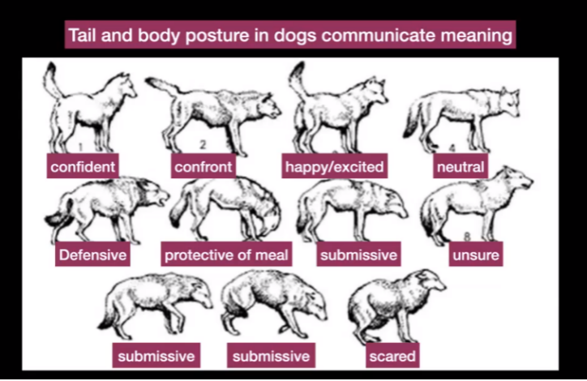
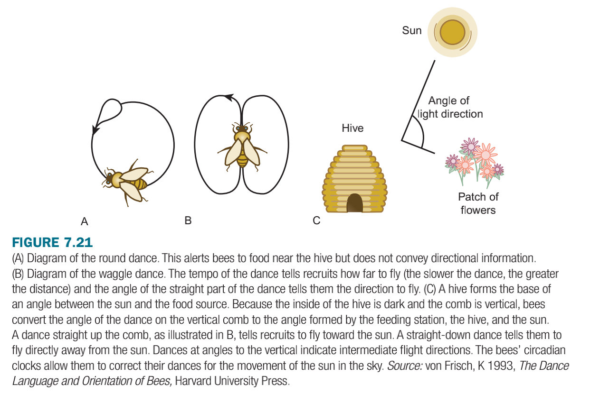
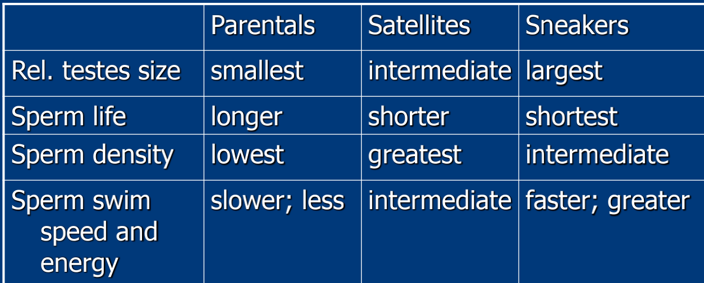

# Glossary: Animals

# Singapore Animals

- Which of these animals have returned to Singapore after an absence of many years?
    1. estuarine crocodile
    2. wild pig
    3. smooth coated otter
    4. sourthern pied hornbill

    wrong answers:

    long tailed macaque, banded-leaf monkey, malayan pangolin, water monitor lizard(not seen all over singapore)

- Solitary animals
  - Leopard cat
  - Common palm civet
  - Reticulated python
  - Hawksbill turtle

- Social animals
  - wild pig

## Cats

when cats live together on large farms → though they are normally solitary, this is because they are fed.

- Community and group behaviours
    1. Male cats patrol (even if unsterilised), but not females.
    2. A cat which is chased away is more likely to be an an intruder.
    3. Head rubbing will occur between familiar or related cats, regardless of gender.

- Territorial
  - the cats in a certain region will patrol and exclude new male cats from entering the region
- Sterilisation

    SPCA: killing 12-16 thousand cats a year -> not working as a mechanism to manage the animals. These stats shows that their method was not working!! It inspired a **trap neuter release method. (TNRM)**

    Community cats -> once called stray cats -> the feeders gain trust, then they do sterilisation when they have the trust and know individual relationships, and every time they cut the ears you know they’re sterilised -> management factor of returning the cats to the same estate with their feeder -> the cats only bother their feeder, and they stay in the ecosystem and prevent others

  - reduced cat yowling as well after sterilisation
- State interaction with community cats: pandemic panic

    Laws not enough: animal welfare groups.

  - > science based: reduce fighting amongst real cats, reduce wailing in Bukit Merah.

    Rumours that cats could carry the disease during SARS.

    AVA stray cat rehabilitation scheme -> people were scared of SARs, there was a rumour that cats were spreading it. And cats were being poisoned and they vanished and taken away-> cats were brought into homes to protect them -> initiative to ‘rehabilitate’ cats disappeared very fast as it was not evidence based, it was rumour based.

    Today its different: not pandemic panic, they’ve reached out to help the animal welfare groups. Also, people started to worry when they saw cats being taken, then posted on Facebook, but the reality was not like in SARs, feeders explained that cats were being abandoned their estates. So NParks trapped these new cats and gave the new cats care and support and tried to make sure they got adopted.

    => find out the cat feeder networks and make sure they know what the taking the cats away about to avoid this kind of panic.

- Sound communication
  - cats miaow in multiple ways, so do dogs → theres a vocabulary they use **in relation to the human**
    - Low frequency purr – content, happy
      - Can help with wound repair
    - Yowling
      - For mates and also challenging other males
      - cat yowling used to be louder, but now that they are sterilised (TMNR initiative) , they don't yowl so much.
      - yowling promoted by hormones like testosterone and when they're aroused
    - 86: Chitter at distant prey
    - Adults mew at kittens and at humans, in a much more vocal way to catch our attention. Scientists think that each cat learns their own language just for their owner, and figures this out by themselves what each meow means. The meows are **unique!!**
      - Talking comes naturally to us - so because of that cats learn that to communicate with us they have to meow.
      - in the wild cats will not meow outside of kittenhood.
- Visual communicaton
  - cats and dogs, pls don't hit ur dog on the head
  - cat video:

    Orange cat
    - expanding shoulders, raising height to look more threatening
    - loudly yowling at black cat

    Black cat
    - tucked his limbs in, tail curled around base, defensive mode
    - ready for action, not making itself widely available
    When orange yowling escalated in pitch and loudness, black cat which was previously avoiding eye contact had to pay attention. Tail twitched and looked up. Did not escalate into fight; cats likely knew each other and black cat knew orange was not going to fight

  - cat video 2

    - Happy cat: tail up, eyes alert, brisk walk
    - Aggressive: Halloween cat posture, ears pointed up, direct
    - Playful: Fast, engagement of cats or people in play
    - Insecure: Avoids contact, looks away, nervous grooming, occurs in smaller cats
    - Confident: curved tail tip, ears forward, alert eyes
    - Scared: Tail down, slinking movements, retreat
    - Curious: Alert, tail in air, eager to investigate

    

## Otters

- Urban Adapted:

    They travel through:

  - HDB estates for traveling through during exploration
  - Green areas next to river banks for resting and drying themselves
  - Waterways for foraging and travel
  - Spaces under road bridges for resting and sleeping
- Problems with urban adaptation
  - maybe 10% killed by cars while crossing roads (territorial lecture)
- why do otters have large litters and familites **in singapore** as compared to other locations?
  - Older siblings stay with the family instead of dispersing as there is sufficient food in our reservoirs and the availability of new optimal habitats is not high.

Smooth-coated otters (*Lutrogale perspicillata*) returned to Singapore’s shoreline after an absence of many decades. Initially only observed in one location, otters have spread to more than half of Singapore’s coastline.What do you think were the proximate and ultimate causes respectively, of this spread of otters?

i. An increase in hormone such as testosterone.
ii. Avoidance of inbreeding.
iii. Natural selection.
iv. Artificial selection.
v. Territoriality.

- answer

    i and ii

- Territoriality
  - Smooth-coated otters are territorial and will fight lethally to protect a territory.
    - in fights, its usually the pup that gets killed.
  - Their territories shrink when raising pups so a subordinate family can occupy a distant area within the territory during that time.
  - Chemical: lift its tail, swipes its tail to deliberately spread it. Dark material laid down is not necessarily defecation, no pile of fishbones, but the darkish patches on the sand are musky heavy molecules marking its territory
    - Only directed at other otters
  - Otters and Dogs conflict (can be considered competitors). Otters have the advantage. Otters vocalise as a territorial warning as well.

## Long Tailed Macaques

- Urban adapted
- Why do macaques move through urban areas?
  - Young but maturing macaques will leave their troop to look for a new troop. This individual was probably moving between two forest patches and will explore the area it passes through for food. In the absence of food, it will move on.
- Why do male macaques leave their troop as they grow older?

    A surge of hormones in its blood upon maturity.

  - not The detection of attractive phermones wafting from a distant, sexually attractive female, rejection from parents
- Facial expressions

    Afflilative (friendly): Lip smacking

    Threat display: Baring teeth, Open-mouthed yawn

    Raised eyebrows

    Fear grin

This is a submissive grin, not a threat.

It is not a open-mouthed baring of fangs.

The animal is being submissive and is nervous about your presence.

Back away and give it space to alleviate its nervousness.

## Fiddler crabs

- explain what appearance and arrangement of these group of fiddler crabs tell you.
  - These animal have a single prominently-coloured and enlarged claw.
  - The claw is not used for feeding on detritus as it is too large.
  - The crabs are evenly spaced and are probably territorial.
  - The enlarged claw is probably waved to attract females and to keep rival males away.
  - Each crab has a small area, so this crowded area mut be a favoured habitat possibly for feeding.
- innate: raised in captivity, they will build tunnels, come out to feed on the surface, try to chase off other males in territorial displays, and try to attract a female
- can see in singapore - chek jawa, pasir ris park, sungei buloh, intertidal

## Civet Cats

Civet Coffee —> an extremely cruel tradition of kopi luak because they mistreat the civets for the economic opportunities because they brand it well.

- omnivore
- Urban Adapted:
- territoriality

    scat will be prominent → signals that this is their territory. their shit reflects what they eat, and also the seeds that they eat can blossom and flourish in the right conditions

  - advertises its presece to rival and potential mates

## Reticulated Python

- Urban adapted
  - strains human animal relations bc people object to them.
- if you see a python in an urban area
  - Keep calm, keep your distance, cordon off the area and inform family members to stay clear of the area. Call ACRES Wildlife Rescue for help, and keep observing the python.

## Southern pied hornbill

Social group: pair (lecture 4)

- males are primarily responsible feeding their partners during brooding.
- **female** raise the chicks by sealing herself inside the tree, the male offers her food from where she is inside the tree through a narrow slit
  - sealed inside, it is safe for her chick
  - parents come back to the same nest year after year
- they are a frugivore generally, but the breeding female needs higher protein and the male will bring her meat

## Hawksbill Turtle

- swim out to see by following brightest light source, which used to be the moon. today they get lost though :(

## Wild pig

- human-animal conflict
  - lead to culling (stopped 2019)
- social animals

## Giant Mudskippers

- Territoriality
  - Rival giant mudskippers warn each other to keep a distance by raising their dorsal fins as a visual signal.
  - Giant mudskippers are aggressive towards each other but when the tide rises, focus on swimming inland into the forest to avoid predators.
  - Territorial giant mudskippers space themselves out in the mudflats (the muddy areas devoid of trees) but some escape upstream to seek refuge amongst the trees as predators come to hunt in the mangroves at high tide. Mudskippers do not like being close and engage in some threats and short fights but are not establishing territory but seeking refuge, so these are short-lived fights. Well, they should be!

    also

  - Burrows are maintained and defended by male mudskippers. These burrows are widely separated from each other.

- foraging

    the mom expands out and sucks using their mouth, and is a blessing to pounce on the animal, with its big mouth that is able to expand outwards.

- Territorial Display
  - raise dorsal fin
  - attack by charging
- Territorial Compression

    student measured 4 individual mudskippers maintaining their territory at low tide. the mudskipper uses the low tide to hunt, with its eyes on the top of the head, able to walk around

    <box>
    💡 mudskippers excavate the burrows, and navigate on their fins, and breath through their gills and skin when in the water. in water, fins just help them balance and navigate

    </box>

    from their burrow and the surrounding areas, they lie in wait to ambush crabs.

  - at high tide when the water comes out, they leave their burrows, which are widely spaced,
  - and they are forced to be coming into a focused space, very difficult interactions coming on, displays are followed up with an attack.
  - if they leave, they will climb up the trees and suck up water with their tail.

## Frogs and bats

Frogs + bats

- frogs are common along rail corridor, and can be as loud as cicadas.

Bats echolocate (loud + high frequencies), essentially screaming all the time.

- Tungara frogs
  - male frog,smaller, hitchhikes, tungara frogs have two toned sounds if they are larger male frogs, else a single note if its small frog
  - Gravid females (swollen with eggs) hear potential consorts and they will swim to the males they choose. The selected male climbs aboard a female's back.
  - She carries him off to fertilize the eggs she will eject.

Danger of courting calls: bats also prefer the larger frog and will go towards the larger sound

- 120 - Frogs, if they spot silhouette of the bat, then the frog is not going to call, —> don't call when the predators is obviously around.
  - Frogs which see approaching bats stop calling, deflate their vocal sac, immerse deeper into water and finally dive and swim away
- bats can see ripples, and pounce at ripples more
  - so frogs all cluster together, if they're all calling at once, zooming in on a single male might be harder.
  - they will call more in large groups and less in smaller groups

### Hammerheaded bat

- `Larynx extends far down abdomen`
- `Able to project powerful sound (honk)`
- Mating Lek:
  - `During mating season, males will assemble and call out to attract females`
  - `Female picks a male (which one seems strong); males at geometric centre mate the most`
  - `Male competition: One male may fly up to another that’s calling, make a raspy aggressive sound and occasionally one will come up and knock the calling guy off his perch and takeover`
  - `When female comes up to attractive males, his call will change into a rapid staccato buzz, pulls his wings in close to his body`
  - `She whittles down her choice to two or three, then finally stops beside one male and they mate`
  - `Not every female goes for the same male; there’re multiple acceptable characteristics`

---

# Birds

- birds are cooperative breeders, what characteristics do they have?

    **Yes:**

    i. Each group has at least one breeding pair.

    iii. Mature individuals can share some degree of parentage.

    **No:**

    ii. The breeding pair do not have to hunt while they have helpers.

    iv. Helpers help to brood the eggs of the breeding pair.

    v. Helpers will never leave the breeding pair due to shortage of territory.

- Deception:

    signallers “deceive” recipients

    White-winged Shrike Tanager (south America) – sentinels signals a “hawk”
    (tactical deception)
    • Flock hides…

    • sentinel flies into the open to hunt: It improves its feeding success at the expense of flock

    Shrike Tanager: One is a sentinel who watches out for predators, and occasionally they will call when there is no predator so they can forage on their own. They don’t do this all the time because its dangerous to forage without a sentinel

Pied Flycatcher:

- Exploitation:

    They mate with multiple females (though they prioritise the female). Initial call and attraction is conducted by a younger bachelor male. The older male, which has mated females, will also sing but less loudly. And when the female turns up, he calls louder to attract the female. If he doesn't win, doesn't matter, he already has mates, but if he does win, nice! Ashe hasn't tired himself out, he can call particularly loudly. The bachelor male has to call, so he can be exploited.

- deception (from textbook)
  - males may possess more than one territory simultaneously.
  - In this species, females gain from mating with a male that has
    no other mates; males may attempt to deceive females about their mating status (mated or unmated).
  - Females assess whether a male has already mated; if he is alone on a territory during repeated visits by the female, then he is probably unmated.
  - Mated males will be absent from the territory (presumably because they are at another territory with their mate)
- Eavesdropping:

    Female chatter response to an attractive male attracts other women to know that there's an attractive male!

kingfisher: advertisement by sound —> that's how they maintain their boundaries

White Handed Gibbon: will also call (the males), to advertise. gibbons are widely dispersed, each occupy a valley, their territory

## sharing territory: pied wagtail

- defend riverside winter territories.
  - renewable food source, forage on insects that wash up on banks . wagtails forage in a cycle to allow replenishment
  - its like a replenishing buffet, where animals come up and be washed up. they will feed along bank A, then they will feed along bank B in a cycle.
- intruders are sometimes tolerated.
  - they're okay with the intruder feeding, because they're eating on areas that are not optimal, in an area that you've already gone over one time.
  - the satellite bird (the one you're sharing with) —> helps to contribute to the defence of the territory.
  - Satellites are only tolerated when the food is high.

## Greylag goose

egg-rolling behavior of the greylag goose is an action pattern observed by Niko Timbergen and  Konrad Lorentz

- The goose will roll an egg that is outside the nest back into the nest in the same manner every time. This will happen with any round object placed outside the nest.
- Every time this action pattern is initiated, it is carried through to completion.

---

Nightingales + nightjar→ call at night, little competition as most birds are diurnal

Strawheaded bulbul → It's supposed to be distributed to Southeast Asia, but people all catch and keep the birds in a cage, but still common through Singapore!

## Herring Gulls

Seabird nesting colonies, which nest on cliffs and ground. Adults take turns to fly out to sea & Return to feed chick

The **Black-headed Gull (Chroicocephalus ridibundus)** is slow to remove egg shells from its nesting site, when compared with other ground-nesting species of birds. Experiment by Tinbergen. Found egg shells attract predators.

- This is a direct consequence of: predation pressure, group living & cannibalism

## Sexual selection displays

- picture

    

Bowerbird: not very brightly colored bc they let the courtship structure, do the talking. This is not a nest. They decorate with whatever they find pleasing, and if the female bird likes it she'll mate with him.

- Singapore → sunbirds build nests

    

### Chicken

- Dominant hen
  - `Whenever dominant hen approaches bowl, subordinate birds will back off`
  - `Just needs to reinforce with a fixed stare (and threat of peck) and subordinate will drop eye contact, drop its head or even walk away`

    o   Hierarchy is already established

- Greater Prairie Chicken
- `There’s a FAP: stamping of feet -> feathers extend over head ->`
- `Male competition: if female looks submissive, male will try to mate but higher-ranking male may chase the male off`

# Mammals

## Bighorn Sheep

- Picture

    

- Prior to the mating season or "rut", rams attempt to establish a dominance hierarchy that determines access to ewes for mating.
- Testosterone peaks during the pre-rut (when social relationships are established), Declines from the pre-rut to the rut.
- Testosterone levels was correlated with social rank.

## Elephants

- matriarchal species, led by the matriach, the oldest female who remembers information about feeding grounds, watering holes and danger areas over generations.
- Elephant herds **do not** always consist of males and females, moving in a formation which protects the younger members.
- audible + subsonic sounds

    caitlyn o'connell ⇒ study what elelphants see

  - elephants freeze suggesting they detect it through the ground, even from long distances away through their feet and their trunk, through this tactile sense
    - Speaker above ground -> least time (7.5 min)
    - Shaker below ground -> more time than speaker (15 min)
    - No alarm call -> most time (25 min)

### Coatis

- solitary males and female groups have a home range (the space they occupy)
- They do not defend a territory, but avoid overlapping their core area of use
- Omnivore

## Cheetahs

- avoid lions but like daylight and will make an extra effort when raising pups.
- They will approach distant prey as closely as possible before bursting into a sprint.

## Hyenas

exhibit sexual dimorphism where the female is larger and dominant

- Female kids might murder their male siblings
- Matriarchal social groups,
  - if leader is killed, there will be a disarray, and their territory may shrink.
- inter-species competition with lions → see below

    hyenas nip at them, have an advantage if lions are distracted with food.

  - if territory overlaps, its because they *need* the additional territory. advantage will go to whichever group can take that territory.
- Courtship:
  - Male hyenas initiate most courtship interactions with larger and more aggressive females.
  - Males display unique “approach-avoid” and “bowing” behaviours - approach/flee behaviours.
  - Males also show signs of fear when trying to mount the females.
  - Males prefer higher ranking females (because their kids will inherit their social status from their mother)
  - Female receptivity is subtle and they are less threatening when receptive, adopting a stance that signals the male.
  - Females are more aggressive to the advances of immigrant males but immigrant males father 97% of all cubs!
- Foraging Strategy:
  - despite their reputation for scavengers they are strong predators.
  - their prey is very large, but they can hunt and bring down prey by separating them from the rest of the pack
  - spotted hyenas are relentless, separate the calf from the rest of the pack, then the parent would think, gg, and rejoin the pack
  - the hyena pack will take down the calf and eat like the whole thing.
    - (scraps are carried off by ants)
  - jackal pups interested in eating the hyena(?) but hyena doesn't wanna eat the jackal pups.

## Lions

- Derek and Beverly Joubert's Eternal Enemies: Lions and hyenas in competition bc
  - The diet of spotted hyenas is similar to that of lions, and the territories of the two species overlap in the area the Jouberts film in.
    - When the smaller spotted hyaenas outnumber and outweigh the larger lions, they are able to drive lions off their fresh kill and feed on it themselves.

- Sound communication + territoriality: lions roaring in the night from dusk to dawn as contact calls + to advertise their territory
  - low frequency roars. can distinguish between other animals. there is a diversity of vocalisation
  - does not roar while hunting prey as it will chase away the prey
  - if they leave the territory they won't be roaring unless they're intruders trying to take over the territory.
- Lionesses are willing to approach single intruders, but when they hear three strangers they might be more wary or not approach. They make decisions based on what they feel is the potential of that group to defend their territory.
- Male lions may not always be visible on the hunt because he is doing patrolling and territorial advertising.

# Elephant Seals

- male is much larger than the female
- the "beachmaster" controls a harem of up to a hundred females

# Bees, wasps, hornets

Beehive, 10s of thousands of workers, you could get like a thousand stings.

## Swarming & safety

→ triggered by a releaser phermone(light phermones), which alarms the hive and they all come out to attack the threat.

- stinger comes off, and the impact on depends on your own immune system
- Human-wildlife Risk assessment
  - if bee attack, just RUN. Don’t wave your hands to get the bee away from you, because if you hit the bee, it triggers more hormone release, and the bees will come to target you.
  - No need to zigzag, don’t dive in water where they’ll wait for you, don’t try to wave the bees away from you.
  - Theres an area where you’re a threat to the beehive, and outside of that area the bees won’t come after you. You just need to run like 500 meters. In the warmer tropics bees do swarm further than like in cold Hong Kong

## hornet interaction

Asian Giant Hornet: can massacre the European honey bees really fast, because the honeybees ability to penetrate the hornet body is limited, the worker bees have soft bodies, and they never co-evolved together. (30 giant hornets can annihilate a colony of 30,000 bees in three hours.)

European honey bees might be learning new strategies (ball defence).

Japanese Honeybee: pre-emptively kill the Asian Giant Hornet scouts. Communicate by waving their torso. At the last moment, they all swarm the giant hornet, and begin to vibrate until they hit 117 degrees -> the hornet can only tolerate 115 degrees while the honey bee can last longer -> this kills the hornet, so the location cannot be shared. The co-evolving means that either can survive, instead of one only

## Communication:  Karl von Frisch

19th century Nobel Prize winner

- waggle dance → vibrations and movements, dancing in figure eight seem
  - direction shows the orientation of the bird
    - angle with relation to the sun. "If the angle is 60 degrees, to the right there'll be flying 60 degrees, to the right of the sun."
  - number of times they waggle says how far the nectar is.

## Western honeybees

workers, females:

1. Nurse bees (younger) - nurse larvae in nests (~first 21 days)
2. Forager bees (older) - collect food and defend the colony (final 1-3 weeks of a 5-week life span)

males: only responsibility is to fertilise the queen, kicked out during hard times

→ coevolve to pollinate plants and carry more pollen. they are very important to pollinate plants.

→ use of herbicides may be causing bees to die. need to regulate?

## Beewolf

- Bee-hunters are solitary, predatory wasps, which are nectar and pollen feeding, except for inseminated females who prey on bees.
- When nesting,  adult females dig multiple-chambered tunnels in sandy slopes in large aggregates. Once mated, the female will hunt for food to provide for the future larvae. Each time she leaves, she hides the nest.
  - she finds, catches, paralyses a bee, brings it back to her tunnels to feed her young with live food.
- demonstrates a fixed action pattern to find nest again after they leave
  - In his experiments, Nikko Tinbergen repositioned placemarkers used by a beewolf to orient itself to discover the purpose of an action pattern.
    - Observation: beewolf circles their nest in an ever-widening circle before flying away to hunt.
    - the place where she builds her tunnels will have a LOT of beewolf nests. so how do they know where to return to?
    - shift the landmarks → she can't find her home again. positioning of the landmarks is important (returns to the shape of the pinecones which is the same)

---

landmarks are set around nest

landmarks are moved

---

# Spiders

### Red-backed Spider *Latrodectus hasselti,* Australian spider

Female spiders have paired independent spermatheca.

- Male inseminates one organ, somersaults 180-degrees, presents its abdomen and female begins to devour the male, why?
  - Cannibalised males copulate longer & fertilise more eggs than males that survive, inseminate both spermatheca
  - Females are more likely to reject subsequent suitors after consuming their first mate.
  - Thus redback males facilitate sexual cannibalism by shifting their abdomen above the female's fangs during copulation.
    - Most males do not survive this process (2/3; survivors mostly die of injuries)
  - However, males are not always successful.
    Females often cannibalize smaller males during first copulation.
    I.e. limiting paternity to 50% (one spermatheca).
    Female control of paternity - mates with subsequent suitor

### Nephila genital plugs. man just breaks off his dick

- boxing glove shaped pedipalp genetalia, stuck inside the female opening. shoves sperm in and plugs the gap.
- males who have castrated themselves and removed their pedipalps are better fighters, and they stick around to protect their palpal plug
- they do use a lot of energy on those giant pedipalps (9% of body weight), but its worth it to make it safer
- males try to escape the females attempt to eat him, because he's just that much smaller.

# damselfly and dragonfly and beetles

## black-winged damselfly

In some like beetles the penis is at the back, so this is so that means for the female to mate she bends her abdomen and integrate, this is a heart shape. So when you see the heart shape, it's dragonflies having sex.

- female is willing, agrees to be in his grip

Sprematheca

- the damselfly penis's ability:

    > This lashing spine covered weapon removes all sperm from previous tourists.
    >
  - the flanges, whiskers, etc is used to scrape out the sperm of others.
  - stage 1: grasp females neck with claspers on the tail
  - in stage 2, male is flexing more and more there, the volume of sperm stored is reduced
  - 3rd stage, as he's flexing in a slightly different way, the sperm volume increases over time as he injects his own sperm.

    this goal overall is to make sure the damselfly or dragonfly gives birth to HIS babies, especially because he takes care of the legs when they're born.

- Mate guarding
  - females are promiscuous — so the male dragonfly tries to stop other damselflies from mating so that they'll be taking care of their own children.
  - tries to ensure she lays eggs in his territory before meeting another male

# Mantis

<box>
🌍 Male submissiveness may not inherently increase male reproductive success. Instead, cautious and fit males escape to mate with multiple females

</box>

- Captive studies:
  - Sexual cannibalism by female hunters with predatory response during courtship.
  - Body of male contributes nutrition (successful courtship)?
- In the wild
  - Hungry females attract fewer males than satiated females; males more cautious too
  - Dismounting is dangerous - cannibalisation often happens then; males spent a longer time on a hungry female before dismounting

# Insects

## Lycid beetles

internal fertilisation

## Trilobite beetles

- **Neotenous -**  meaning that the adult retains the juvenile form, now the male beetle it metamorphosed and became a winged anymore right, so you can see, male and female, and the relative sizes something like this and also the females much larger than the male.
- raise her abdomen. So you can see, when the abdomen is raised she's actually wafting pheromones out of the rear.
- Attract male from kilometers away-  encounter the chemical molecules and he will fly in.
- Much smaller male, remains attached for many hours, fertilises 200 eggs ish, dies inside the female

## Cicadas

- after the a larval stage, live on trees. terminal moult has wings. Winged cicadas emerge through the back (split in the moult) Really small
- predictable outbreaks in temperate countries are a spectacle people like to watch
- Sound is emerging through this thin panel right in the Center of the body and the abdomen is pushing air out through it.
- "cicada rain"
  - long proboscis to sip on tree water, almost half the body, which they insert into the tree trumk and tap the xylum vessels.
  - Density of nutrients is not high, so the water is excreted, and you'll see a puddle on the ground

# Other primates

East African Vervet monkey's alarms and grunts -> too high frequency to hear, and need to be recorded on a sonogram. Harsh sounding grunts also sound uniform, but they're actually different.

Kingfishers calling even at night - light pollution?

## Baboon

With baboons, predation pressure is a significant issue with several large carnivore species resident in the area. So it is much better to feed in poorer grouds for a long time with a lower predator density.

## Chimpanzee

- Chimpanzee patrols encroach neighbouring territory quietly to corner and attack rival individuals with superior numbers. Need to be on alert.
- A chimpanzee troop expanding its territory will enter the territory of neighbors to kill several individuals, over numerous episodes. It took repeated lethal attacks to expand a group's territory. There was no other interaction even when some members of different groups may have been related.
- Chimpanzee patrols are assembled by vocalisation and become quiet as they enter rival territory, remaining silent until they close in and attack. Then to intimidate and confuse their opponents they scream and vocalise
- May cannibalise their own species "chance for some extra protein"

# Endangered Animals (kakapo)

The Kakapo (Strigops habroptilus) or owl parrot, is a large, flightless, nocturnal, ground-dwelling, herbivorous parrot endemic to New Zealand. It’s natural behaviour has no defence against predators such as cats, rats, ferrets, and stoats introduced to New Zealand by man. It is now critically endangered. Is this animal **poorly adapted to its habitat**?
[4 marks; 8 lines of text]

- answer??

    The animal is was not poorly adapted to the habitat of New Zealand, which had few ground dwelling predators before the influx of man. Man has changed their habitat.

    However, you could say it is might not be biologically fit for its current environment as it faces difficulty in surviving as it is easy prey for imported predators. They will have difficulty reproducing and sustaining the species. Hence they are now poorly adapted

- part to add to the answer

    *"The kakapo's lack of defense against animals introduced to New Zealand by man is due to the fact it did not co-evolve with them.*

    *This unnatural situation created by man is not a failure of the kakapo to adapt to the natural environment."*

- whales song in frequencies we can't hear
  - each whale pod (social animals) have unique songs which all the males will sing, but you can probably figure out the individual as well. they sing for a very long time. the next year you will have a new one
  - Song may last 6-35 min. Pods may sing continuously up to 22h
  - marking their territory?
  - sent whale song out to space!
- pikas (documentary) canadian mountains. relative of rabbits
  - eat leaves, which are collected, which might be poisonous. The poison is a natural preservative
  - variety of leaves because some of them you can eat earlier and some of them you can eat later
  - vocalise to chase off territory

# Mice

- mice → ultrasonic sounds we can't hear, pups call for parents,

## **Avoid male aggression in lab mice**

✤ **Separate dominants**

✤ **Watch unfamiliars**

✤ **Introduce in neutral, no scent setting**

✤ **Avoid female scent** (even on the clothes of a lab worker)

✤ **Not complete removal of soil bedding** (subordinates may become unfamiliar)

✤ **Avoid prolonged single housing**

## Antechinus mouse

Females: ovulation coincides with maximum prey abundance; shortened, synchronised annual mating period; mating promiscuously.
Males: intensified reproductive competition between males; elevated stress hormone levels and lethal immune system collapse – invest in copulations, reducing survival
Species with suicidal reproduction have shorter mating seasons and larger testes: body size

# Fish

<box>
🕶️ courtship dances are interactive fixed action patterns.

</box>

Three-spined stickleback

- red belly. red colour will display as a territorial contest. key stimuli is red belly + zigzag dance → triggers a fixed action pattern that gets the female to lay eggs, adn at the sametime the male will release sperm. This is an example of synchronity.

- Courtship:
  - he prepared a nest (stay at home husband,) put on a display and then entice the female with his zig-zag dancing (Fixed AP for female), stimulating egg deposition, and he releases sperm at the same time

Satellites, Sneakers, Parentals:

- Bluegill sunfish mating strategy

    External fertilisation — so fish have to be aware and defend their territory

  - bypassing territories: sneakers and satellites
    - fish reproduction: males build nests, attract females, protect nest. there is external fertilisation, egg and sperms released into the water. its true that there's synced pheromones that dictate this breeding, but people are sometimes able to sneak in
    - 3 types of fish

            

      - parental — older, territorial
        - (mature later, wait, able to control territory. ≥7 years old) big enough to mantain a territory
        - long lasting, low density sperm
        - testes sizes are the smallest
        - prioritise growth.
      - sneaker — younger, dart in and shed sperm
        - (precocious, steal, parasitic) (2-4 years)
        - varies between teh other two
        - big balls
          - guarantee that they will grow, highly competitive, high reproduction rate
      - satellite: intermediate age, mimic females, enter the territory slowly pretending to be a girl, and releasing the sperm. (4-6 years)
        - highest density and half the longevity. Higher density increase likelyhood of success

    For all three strategies to occur, all of them must be successful for at least some of the time. As a successful strategy, they are each able to produce young which are likely to reproduce in a similar manner. Thus all three genetic varieties persist, although one may be a dominant strategy.
